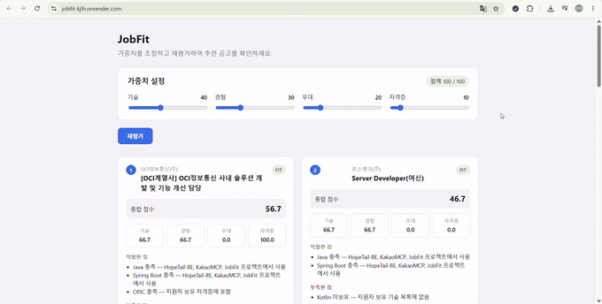

# JobFit

사용자 조건과 가중치를 반영해 채용공고 적합도와 추천 근거를 제공하는 AI 기반 맞춤형 채용공고 추천 서비스

- **배포**: https://jobfit-kjih.onrender.com
- **API**: https://jobfit-api-xdu0.onrender.com

## 데모



기술·경험 중심(40/30/20/10)에서 우대사항 중심(20/20/40/20)으로 가중치를 변경하면
2~4위 순위가 재배열됩니다.

> Render 무료 플랜을 사용하여, 일정 시간 요청이 없으면 서버가 절전 상태로 전환됩니다.
> 첫 접속 시 응답까지 최대 1분 정도 소요될 수 있습니다.

## 문제 정의

채용 시즌에 지원자는 수십 개의 공고를 직접 읽고 자신의 경험과 하나씩 대조해야 합니다.
기존 채용 플랫폼의 추천은 키워드 일치 기반이라 "왜 이 공고가 추천되었는지",
"내 경험 중 무엇이 부족한지"를 알기 어렵습니다.

JobFit은 공고의 요구사항을 구조화하고, 사용자가 직접 설정한 평가 기준에 따라
적합도를 계산한 뒤 **판단 근거를 함께 제시**합니다.

실제 출력 예시입니다.

```
OCI정보통신(주) — 사내 솔루션 개발 및 기능 개선 담당
지원 가능 · 종합 56.7점 (기술 66.7 / 경험 66.7 / 우대 0.0 / 자격증 100.0)

적합한 점
  Java 충족 — HopeTail-BE, KakaoMCP, JobFit 프로젝트에서 사용
  Spring Boot 충족 — HopeTail-BE, KakaoMCP, JobFit 프로젝트에서 사용
  OPIC 충족 — 보유 자격증 목록에 포함

부족한 점
  React 미보유
```

## 핵심 차별점

- **사용자가 평가 기준을 조정** — 기술/경험/우대사항/자격증 가중치를 직접 설정하고, 변경 시 추천 순위가 어떻게 달라지는지 확인
- **필수 조건과 선호 조건 분리** — 필수 조건 불충족 시 높은 기술 점수에도 상위 노출되지 않음
- **근거 기반 판단** — 점수만 제시하지 않고 공고 요구사항과 사용자 프로젝트 경험을 연결해 표시

### 가중치 변경에 따른 추천 순위 변화

동일한 공고 8건을 서로 다른 가중치로 평가한 결과입니다.

| 순위 | 기술 40 / 경험 30 / 우대 20 / 자격증 10 | 기술 20 / 경험 20 / 우대 40 / 자격증 20 |
|---|---|---|
| 1 | OCI정보통신 56.7 | OCI정보통신 46.7 |
| 2 | 토스뱅크 46.7 | **킨코스코리아 35.5** |
| 3 | 킨코스코리아 39.2 | 위드네트웍스 30.1 |
| 4 | 위드네트웍스 31.7 | **토스뱅크 26.7** |

우대사항 비중을 높이면 토스뱅크가 2위에서 4위로, 킨코스코리아가 3위에서 2위로 이동합니다.
자격요건 충족도는 높지만 우대사항이 명시되지 않은 공고는 하위로 밀립니다.
기술 가중치를 높이면 Java/Spring 기반 공고가 상위로 이동합니다.
평가 기준이 바뀌면 추천 결과도 함께 달라진다는 것을 확인할 수 있습니다.

## 기술 스택

| 영역 | 기술 |
|---|---|
| Backend | Java 21, Spring Boot, Spring Data JPA |
| Database | PostgreSQL 16 |
| AI | OpenAI API (gpt-4o) |
| Frontend | React, TypeScript, Vite |
| Infra | Docker, Render |

## 아키텍처

```
[React SPA]  ──HTTP──▶  [Spring Boot API]  ──▶  [PostgreSQL]
                              │
                              └──▶  [OpenAI API]
                                     · 공고 요구사항 구조화
                                     · 판단 근거 생성
```

평가 요청은 다음 순서로 처리됩니다.

```
POST /api/evaluations
  │
  ├─ JobRequirementExtractor    공고 원문 → 구조화 (캐시 우선, 실패 시 정규식 fallback)
  ├─ RequiredConditionChecker   경력·고용형태·마감일·직무 필수 조건 판정
  ├─ ScoreCalculator            기술·경험·우대·자격증 항목별 점수 산출
  ├─ EvaluationWeight           사용자 가중치 적용 → 종합 점수
  └─ EvaluationReasoningGenerator  판단 근거 문장 생성
```

## 도메인 모델

```
JobPosting                     채용공고
├── source                     공고 출처
├── externalId                 출처별 공고 ID   ┐ 복합 유니크 제약으로
└── ...                                        ┘ 중복 수집 방지

UserProfile                    사용자 프로필
├── UserSkill        (1:N)     보유 기술
├── UserProject      (1:N)     프로젝트 경험 (사용 기술 포함)
├── UserCertificate  (1:N)     자격증 (등급·취득일 포함)
└── EvaluationWeight (1:1)     항목별 가중치 (합계 100 검증)

JobRequirementExtraction (1:1 with JobPosting)
                               LLM 추출 결과 캐시
```

**보유 기술과 프로젝트 경험을 분리한 이유**

자기 신고 숙련도는 신뢰하기 어렵기 때문에 숙련도 필드를 두지 않았습니다.
대신 기술의 실제 활용 여부를 프로젝트 경험에서 역산합니다.

| 상태 | 판정 |
|---|---|
| 기술 보유 + 프로젝트 사용 이력 | 충족 (근거 제시 가능) |
| 기술 보유만 | 부분 충족 |
| 미보유 | 미충족 |

이 구조 덕분에 "Redis 충족 — HopeTail-BE에서 로그아웃 블랙리스트 구현에 사용"처럼
근거를 자동으로 도출할 수 있습니다.

## 적합도 판정 방식

### 1단계 — 필수 조건 판정

하나라도 충족하지 못하면 종합 점수와 무관하게 **지원 불가**로 분류합니다.

| 조건 | 판정 기준 |
|---|---|
| 경력 | 신입 지원자에게 최소 경력이 요구되는 경우 |
| 고용 형태 | 희망 고용 형태와 공고가 불일치하는 경우 |
| 마감일 | 지원 기간이 종료된 경우 |
| 직무 분류 | 공고 직무가 희망 직무와 무관한 경우 |

기술 적합도가 높아도 필수 조건에서 걸러지는 사례가 실제로 확인됩니다.

- **링크알파코리아** — 기술 스택과 도메인이 겹치지만 경력 5년 이상 요구로 지원 불가
- **누비랩** — 보유 기술과의 매칭도가 8건 중 최상위이나 인턴 채용이라 지원 불가

### 2단계 — 항목별 점수와 가중치

필수 조건을 통과한 공고에 대해 항목별 점수를 계산하고 사용자 가중치를 적용합니다.

```
종합 점수 = 기술 × w1 + 경험 × w2 + 우대사항 × w3 + 자격증 × w4   (w 합계 = 100)
```

| 항목 | 계산 방식 |
|---|---|
| 기술 | 공고 필수 기술 중 보유 비율. 프로젝트 사용 이력이 있으면 만점, 보유만 하면 부분 점수 |
| 경험 | 프로젝트별 요구 기술 매칭 비율의 최댓값 |
| 우대사항 | 공고 우대 기술 중 보유 비율 |
| 자격증 | 요구 자격증 중 하나라도 보유하면 충족 (공고의 자격증 요구는 대부분 "A 또는 B" 형태) |

## API

| Method | Endpoint | 설명 |
|---|---|---|
| POST | `/api/jobs` | 공고 등록 (중복 시 409) |
| GET | `/api/jobs` | 공고 목록 조회 |
| GET | `/api/jobs/{id}` | 공고 단건 조회 (없으면 404) |
| POST | `/api/users/profile` | 프로필 등록 (기술·프로젝트·자격증·가중치 포함) |
| GET | `/api/users/profile/{id}` | 프로필 조회 |
| PUT | `/api/users/profile/{id}/weights` | 가중치 수정 |
| DELETE | `/api/users/profile/{id}` | 프로필 삭제 |
| POST | `/api/evaluations` | 전체 공고 평가 (적합도순 정렬) |
| GET | `/api/evaluations/{userProfileId}/jobs/{jobPostingId}` | 단건 평가 |

## 테스트

핵심 판단 로직을 계층별로 검증합니다.

| 대상 | 검증 내용 |
|---|---|
| `JobRequirementParser` | 경력 조건 텍스트 파싱 (실제 공고 8건의 표기 전부) |
| `RequiredConditionChecker` | 경력·고용형태·마감일·직무 판정 |
| `SkillScoreCalculator` | 기술 매칭 3단계 (사용 이력 / 보유 / 미보유) |
| `ExperienceScoreCalculator` | 프로젝트별 매칭 비율 |
| `CertificateScoreCalculator` | 자격증 OR 조건, 대소문자 무시 매칭 |
| `EvaluationService` | 필수 조건 판정 → 점수 산출 전체 흐름 |
| `UserProfileService` | 연관 엔티티 cascade 삭제 |

**외부 의존성 격리**

- LLM 호출은 `LlmClient` 인터페이스를 통해 이루어지며, 테스트에서는 고정 응답을 반환하는 구현체로 대체합니다. 실제 API를 호출하는 통합 테스트는 `@Disabled`로 분리했습니다.
- 마감일 판정은 `Clock`을 주입받아 처리하므로, 테스트에서 기준 시각을 고정할 수 있습니다. 시간이 지나도 테스트 결과가 달라지지 않습니다.

## 실행 방법

**1. 환경변수 설정** — 루트에 `.env` 파일 생성

```
DB_PASSWORD=your_password
OPENAI_API_KEY=your_api_key
```

**2. DB 실행**

```bash
docker compose up -d
```

**3. 애플리케이션 실행**

```bash
./gradlew bootRun
```

**4. 프론트엔드 실행**

```bash
cd frontend
npm install
npm run dev
```

> 로컬에 PostgreSQL이 설치되어 있는 경우 5432 포트가 충돌하므로,
> Docker 컨테이너는 호스트의 **15432** 포트에 매핑되어 있습니다.
> (`docker-compose.yaml`: `15432:5432`)

## 설계 결정 기록

### 공고 수집 방식

당초 사람인 Open API를 통한 자동 수집을 계획했으나, 외부 API 승인 절차에 의존하는
구조는 일정 리스크가 크다고 판단했습니다.

이에 공고 수집을 인터페이스로 추상화하고, 초기 버전은 직접 구축한 데이터셋으로
동작하도록 설계했습니다. 외부 API 연동이 가능해지면 구현체를 추가하는 것만으로
확장할 수 있습니다.

프로젝트의 핵심 가치는 공고 데이터의 출처가 아니라 **적합도 판단과 근거 제시**에
있으므로, 이 결정이 프로젝트 목표를 훼손하지 않는다고 보았습니다.

### LLM과 규칙 기반의 역할 분리

LLM에 점수 산출을 맡기면 동일 입력에서도 결과가 흔들립니다.
따라서 LLM은 **입력 정제와 출력 설명**만 담당하고, 판정과 계산은 규칙 기반이 수행합니다.

| 담당 | 역할 |
|---|---|
| LLM | 공고 원문에서 요구 기술·자격증·경력 조건·직무 분류 추출, 판단 근거 문장 생성 |
| 규칙 기반 | 필수 조건 판정, 항목별 점수 계산, 가중치 적용 |

이 구조 덕분에 동일 요청을 반복해도 종합 점수가 소수점까지 일치합니다.

**LLM 도입으로 해결된 것**

규칙 기반(정규식) 파싱만으로는 다음을 처리할 수 없었습니다.

| 사례 | 규칙 기반 | LLM |
|---|---|---|
| 우대사항 목록에 섞인 "OPIC 제출 필수" | 탐지 불가 | `requiredCertificates: [OPIC]` |
| 개발 직군이 아닌 공고 (호텔 채용) | 판정 불가 | `jobCategory: OTHER` |
| "MSA", "코어뱅킹" 등 비기술 용어 혼입 | 기술로 오인 | 제외 |
| "3년 이하" vs "5년 이상" | 표현 변형에 취약 | `maxYears` / `minYears` 구분 |

**장애 대응과 비용 관리**

`LlmClient`를 인터페이스로 분리해, LLM 호출이 실패하면 기존 정규식 파서로 fallback합니다.
추출 결과는 DB에 저장하여 동일 공고에 대한 중복 호출을 방지합니다.
단, fallback으로 생성된 결과는 캐싱하지 않습니다. 일시적 장애로 얻은 저품질 결과가
영구히 고착되는 것을 막기 위해서입니다.

## 트러블슈팅

### LLM 출력의 불안정성

`gpt-4o-mini`로 시작했으나 적합/부족 항목 분류가 호출마다 뒤바뀌는 문제가 있었습니다.
보유하지 않은 기술을 "충족"으로 판정하거나, 요구 기술이 없는 공고에서 근거를 지어내는
사례가 반복되었습니다.

프롬프트에 판정 규칙을 명시적으로 추가하자 이번에는 반대 방향의 문제가 나타났습니다.
매칭 자체를 거의 수행하지 못하고 대부분을 "부족한 점"으로 분류하는 과도한 보수화였습니다.

프롬프트 조정만으로는 한계가 있다고 판단해 모델을 `gpt-4o`로 상향하고
`temperature`를 0으로 설정한 뒤 분류 정확도가 안정화되었습니다.
다만 완전한 결정론적 동작은 확보하지 못했으며, 추출 결과를 캐싱하여
동일 공고에 대한 판정이 유지되도록 보완했습니다.

### 읽기 전용 트랜잭션에서의 캐시 저장 실패

평가 조회 서비스는 클래스 레벨에 `@Transactional(readOnly = true)`가 적용되어 있습니다.
PostgreSQL은 읽기 전용 트랜잭션을 세션 레벨에서 강제하므로,
추출 결과를 캐시에 저장하는 INSERT가 실패하는 문제가 있었습니다.

캐시 저장 로직에 `Propagation.REQUIRES_NEW`를 적용해 별도 트랜잭션에서
실행되도록 분리하여 해결했습니다.

### 시간에 의존하는 판정 로직

마감일 판정에 `LocalDateTime.now()`를 직접 사용하면 테스트가 실행 시점에 따라
결과가 달라집니다. 검증용 데이터셋의 마감일이 지나면 기대값이 모두 무효가 되는
문제도 있었습니다.

`Clock`을 빈으로 주입받도록 변경하고, 테스트에서는 `Clock.fixed()`로 기준 시각을
고정했습니다. 운영 환경에서는 시스템 시각을 사용하되, 프로퍼티로 기준 시각을
덮어쓸 수 있도록 하여 데모 환경에서도 데이터셋을 일관되게 사용할 수 있습니다.

### 공고 문구의 모호성

일부 공고는 자격요건과 우대사항이 한 섹션에 혼재되어 있어, 특정 항목이 필수인지
우대인지 사람이 읽어도 해석이 갈립니다. 예를 들어 우대사항 목록 안에
"OPIC 또는 TOEIC Speaking 점수 제출 필수"가 포함된 경우,
이를 지원 자격으로 볼지 가점 요소로 볼지 판단이 어렵습니다.

이러한 모호성은 LLM 추출 결과의 불안정성으로 이어졌습니다.
완전한 자동 판정보다는 `checkPoints`(확인 필요 항목)로 사용자에게 제시하고
최종 판단을 맡기는 방향이 적절하다고 보았습니다.

## 알려진 한계

- 단일 사용자 프로필을 대상으로 동작합니다. 인증을 구현하지 않아 프론트엔드에서 프로필 ID를 상수로 참조하며, 인증 도입 시 세션 기반 조회로 대체 가능한 구조입니다.
- 공고 원문의 서술 방식에 따라 LLM 추출 품질이 달라집니다. 기술 스택이 별도 섹션으로 정리된 공고와 업무 설명에 녹아 있는 공고의 추출 정확도에 차이가 있습니다.
- 평가 시 공고 수만큼 LLM을 호출하므로 응답에 시간이 소요됩니다. 추출 결과는 캐싱되지만 근거 생성은 사용자 조건에 따라 달라져 캐싱하지 않습니다.

## 향후 확장

- **공고 등록 자동화** — 공고 원문 텍스트를 입력받아 LLM으로 구조화하는 엔드포인트 추가. 다건 일괄 등록을 지원하여 수동 입력 비용을 줄일 수 있음
- 복수 채용 플랫폼 연동 및 중복 공고 판별
- 사용자 행동 기반 가중치 자동 조정
- IT 외 직무별 평가 전략 추가 (현재는 개발 직무 특화)
- CI 파이프라인 구성으로 push 시 테스트 자동 실행
